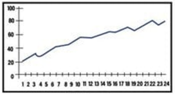
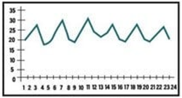
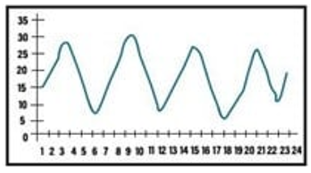
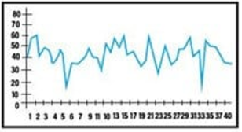
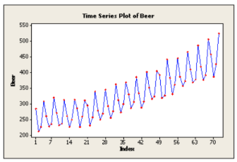
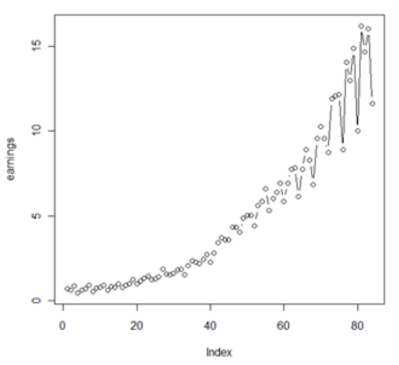
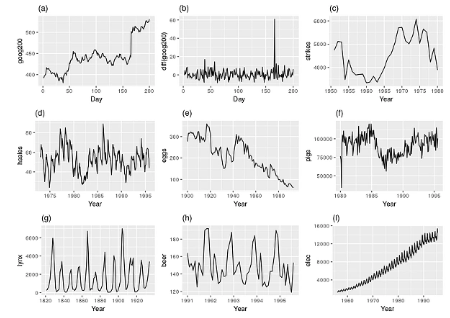

# Bienvenidas y bienvenidos

-   Presentacion del proyecto GEOHealth
-   Breve introduccion (1 min cada uno)
-   Presentacion del curso

# Curso: Introduccion al analisis de series de tiempo para ciencias de la salud

-   En el area de las ciencias de la salud, es frecuente observar datos que son recolectados en formas de **series de tiempo**

    -   Datos que son obtenidos en momentos sucesivos y en intervalos \~iguales

-   Este curso proporciona a las y los participantes definiciones y conceptos basicos de los diferentes tipos y modelos de series de tiempo comunmente utilizados en el area de la salud, asi como tambien las habilidades basicas para realizar, interpretar y comunicar los resultados de ST basicas. **Enfoque aplicado y practico.**

-   El curso incluye clases interactivas, desarrollo de ejercicios practicos en R y sesiones de trabajo individuales que incluyen lecturas y ejercicios de practica.

# Objetivo general del curso

Al finalizar el curso, los participantes serán capaces de disenar, implementar e interpretar analisis de series de tiempo para evaluar el impacto de exposiciones ambientales (temperatura y material particulado PM2.5) sobre desenlaces de salud (mortalidad y hospitalizaciones), utilizando modelos de regresion para datos de conteo y modelos de rezagos distribuidos no lineales en R.

# Operacion del curso

-   5 sesiones en total

-   Tiempo de dedicacion

    -   Presencial: 5 sesiones de \~4 h
    -   Trabajo individual: 10 h en total

*Nota: Los tildes han sido omitidos.*

------------------------------------------------------------------------

# Sesion 1: Fundamentos y exploracion de datos temporales en R

## Aprendizajes esperados

Al final de la sesion, las y los participantes podran:

1.  Definir una serie de tiempo y reconocer sus componentes (tendencia, estacionalidad, ciclo, irregular).
2.  Distinguir intuitivamente entre series estacionarias y no estacionarias, y por que esta distinción importa en epidemiologia ambiental.
3.  Explorar una serie diaria de salud y de exposicion ambiental con R: carga, inspeccion, visualizacion, descomposicion y autocorrelacion.
4.  Formular hipotesis preliminares sobre la relacion entre la temperatura, el PM2.5 y los desenlaces de salud en Lima.

# Bloque 1: Que es una serie de tiempo?

## Definicion

-   Una **serie de tiempo** es una secuencia de observaciones $\{y_t\}_{t=1}^T$ de una misma variable, ordenada por un indice temporal con intervalos regulares (diarios, semanales, mensuales, anuales).

-   El orden importa: a diferencia de un analisis transversal, los valores **no son intercambiables**.

    -   Existe dependencia de los datos y modificarlos podria alterar su significado

-   Ejemplos tipicos en salud ambiental:

    -   $y_t$ = numero de muertes diarias en Lima Metropolitana

    -   $x_t$ = temperatura media diaria

    -   $z_t$ = concentracion promedio diaria de PM2.5

### Ejemplo: *Global mean temperature anomalies (C) per month. NOAA*

Fuente: <https://www.ncei.noaa.gov/access/monitoring/climate-at-a-glance/global/time-series>

Data: South America, Average Temperature Anomaly, Land, Montly: 1850-2025. Anomalias respecto a 1901-2000 average.

```{r exampleCO2}
# Title: Global Land Average Temperature Anomalies
# Units: Degrees Celsius
# Missing: -999
# Base Period: 1901-2000

library()
library(dplyr)
library(tidyverse)
anom <- read_csv("Databases/SA_anomalies_1850_2025.csv")

View(anom)
str(anom)

anom <- anom %>% 
  separate(Date, into = c('year', 'month'), sep = 4)

anom <- anom %>%
  mutate(Date = make_date(year, month))
View(anom) # Continua siendo una df sin formato "serie de tiempo"
```

Convertir a objeto "serie de tiempo" -\> funcion `ts()`

-   start = the starting time of the time series
-   end = the ending time of the time series
-   frequency = the number of observations per unit of time.

```{r to_ts}
anom_ts <- ts(anom$Anomaly, start = 1850, end = 2025, frequency = 12)
head(anom_ts)
```

Como graficar la serie? -\> Diferentes alternativas: `plot()`, `ggplot()`

```{r ggplot_CO2}
names(anom)

library(ggplot2)
anom %>%
  ggplot() +
  geom_line(aes(x= Date, y = Anomaly)) +
  #geom_smooth(aes(x= Date, y = Anomaly), span = 0.1) +
  geom_hline(yintercept = 0, linetype = "dashed", color = "red", linewidth = 1) +
  scale_x_date(date_breaks = "10 years", date_labels = "%Y") +
  xlab("Date") +
  theme_bw()
```

> **Conclusiones?**

## Objetivo del analisis de ST

-   Determinar un modelo que describa el **patron** de la serie temporal

-   Los objetivos tipicos en salud ambiental son cuatro:

    -   **Etiologico/asociacion:** estimar el efecto de un cambio en la exposicion sobre el riesgo (p. ej., el riesgo relativo de mortalidad por cada 10 $\mu$g/m³ de aumento del PM2.5).

    -   **Causal:** estimar el efecto de una intervencion (p. ej., el cierre de un corredor vial al transito vehicular) o de un evento (p. ej., una ola de calor).

    -   **Predictivo:** producir pronosticos a corto plazo de carga hospitalaria.

    -   **Vigilancia:** detectar excesos de mortalidad o aumentos anomalos respecto a un valor esperado.

## Componentes clasicos de TS

Cualquier serie observada se puede pensar como la combinacion de cuatro componentes:

$$
y_t = T_t + S_t + C_t + \varepsilon_t
$$

> **Por que esto importa?** Si queremos estimar el efecto de la temperatura sobre la mortalidad, la estacionalidad y la tendencia son **confusores temporales**: covarian con la temperatura y con la mortalidad. No controlarlos lleva a estimaciones sesgadas.

**Tendencia** ($T_t$): Movimiento de largo plazo (creciente, decreciente, estable: envejecimiento poblacional, mejora del sistema sanitario, urbanizacion). Refleja cambios estructurales o de crecimiento/decrecimiento sostenido.



**Estacionalidad** ($S_t$): Fluctuaciones periodicas que se repiten en un plazo fijo y conocido (ej., cada 12 meses, cada 7 dias). Se deben a factores climaticos, calendario (meses, dias festivos), costumbres sociales, etc.



**Ciclo** ($C_t$): Fluctuaciones de largo plazo alrededor de la tendencia, pero con duracion y magnitud no fijas. A menudo relacionadas con ciclos economicos o climaticos de gran escala (ej., El Niño). Son mas dificiles de identificar y modelar que la estacionalidad.



**Componente Aleatorio/Irregular** ($\varepsilon_t$): Lo que queda despues de remover T, S y C. Representa la variabilidad impredecible o "ruido". Idealmente, este componente deberia ser ruido blanco.



Una descomposicion clásica es la **aditiva, o multiplicativa** para series con varianza creciente:

**Serie de tiempo aditiva**: **:** $Y_t = T_t + S_t + C_t + \varepsilon_t$ Asume que el valor observado a tiempo $t$ es la suma de sus componentes. Se utiliza cuando la magnitud de las fluctuaciones estacionales o variacion residual no cambia significativamente en el tiempo



**Serie de tiempo multiplicativa:** $Y_t = T_t\times S_t\times C_t\times \varepsilon_t$ Asume que la relacion es multiplicativa (variacion estacional incrementa en el tiempo). Se puede convertir en aditiva, tomando el log

{width="355"}

## Caracteristicas distintivas de ST relevantes para epidemiologia

Lo que distingue a una serie de tiempo de una muestra clasica de observaciones independientes es que las observaciones cercanas en el tiempo estan **correlacionadas**: la mortalidad de hoy se parece a la de ayer, en parte porque comparten determinantes lentos (tamano y estructura etaria de la poblacion, capacidad hospitalaria, circulacion viral) y rapidos (clima, contaminantes).

Esta **autocorrelacion viola los supuestos de independencia** de la regresion clasica y obliga a un tratamiento estadistico cuidadoso.

En especifico, las caracteristias distintivas son:

**Autocorrelación serial:** La autocorrelación de orden $k$ se define como $\rho_k = \mathrm{Cor}(Y_t, Y_{t-k})$. En series de mortalidad diaria es fuertemente positiva en los primeros dias y se atenua lentamente; en series de PM2.5 tambien. Si no la modelamos, los errores estandar estaran subestimados y los intervalos de confianza seran demasiado angostos.

**Estacionariedad:** Una serie es estacionaria (en sentido debil) si su media y su varianza no cambian con el tiempo y su autocovarianza depende solo del rezago.

-   Series estacionarias pueden ser utilizadas para **predecir** medidas en el tiempo de manera mucho as facil con tecnicas estandars (AR(p): captura la dependencia de valores pasados, MA(q): captura la dependencia de errores pasados, ARIMA). En caso que las ST tengan tendencia o estacionalidad (o ciclos), se deben remover.
-   Casi ninguna serie de salud ambiental es estacionaria en bruto: lo sera solo despues de remover tendencia y estacionalidad.

**Estacionalidad multiple:** Hay un ciclo anual (verano/invierno) y un ciclo semanal (los lunes hay mas altas hospitalarias programadas; los registros administrativos suben los dias habiles). En Lima, el patron estacional de PM2.5 esta determinado por la inversion termica costera, que produce un maximo en mayo-septiembre.

**Confusion por *time-varying confounders***: Variables como circulacion de virus respiratorios, dias feriados, paros, eventos masivos, pueden actuar como confusores no observados que correlacionan con las exposiciones ambientales y con la mortalidad.

**Que se puede observar en los siguientes graficos?**

{width="597"}

## Principales metodologias para el analisis de ST en epidemiologia ambiental

**ARIMA (AutoRegressive Integrated Moving Average)**

-   Modela $Y_t$ como combinacion lineal de sus rezagos y de errores rezagados.

-   Asume normalidad (o aproximacion), por lo que es problematico para conteos pequenos.

-   *Ventaja:* captura la autocorrelacion de manera natural; muy bueno para pronostico.

-   *Desventaja:* poco apto para incluir multiples covariables exogenas con efectos no lineales y rezagos distribuidos.

**Regresion de Poisson / quasi-Poisson (GLM)**

-   Modela el conteo diario con link logaritmico y una distribucion de Poisson, controlando tendencia, estacionalidad y dia de la semana mediante terminos parametricos (splines naturales).

-   *Ventaja:* simple, transparente, facil de interpretar (los coeficientes son log-RR).

-   *Desventaja:* las relaciones exposicion-respuesta no lineales requieren imponerlas a mano.

**Modelos aditivos generalizados (GAM)**

-   Extienden el GLM permitiendo que el efecto de cada covariable sea una funcion suave $f(x)$ estimada de los datos.

-   *Ventaja:* descubren no linealidades sin pre-especificarlas.

-   *Desventaja:* requieren elegir parametros de suavizado (df) con criterio.

**Modelos no lineales distribuidos en el rezago (DLNM)**

-   Combinan dos dimensiones: la relacion exposicion-respuesta y la estructura de rezagos (como se distribuye el efecto en los dias posteriores a la exposicion).

-   *Ventaja:* permiten estimar simultaneamente la forma de la curva exposicion-respuesta y el patron de retardos, incluyendo efectos diferidos.

-   *Desventaja:* curva de aprendizaje mas compleja y mayor numero de parametros.

**Series de tiempo interrumpidas (ITS)**

-   Diseno cuasi-experimental para evaluar el impacto de una intervencion que ocurre en un punto conocido del tiempo (regulacion, cierre, politica).

-   *Ventaja:* permite inferencia causal en ausencia de aleatorizacion.

-   *Desventaja:* sensible a co-intervenciones y a la eleccion del modelo subyacente.

**Modelos *case-crossover***

-   Un diseño *self-matched* que compara los dias en que ocurrio un evento con dias control del mismo individuo. Util cuando interesan eventos individuales y los confusores no varian en el corto plazo.

# Bloque 2: Carga, inspeccion y visualizacion

Antes de cualquier modelo, siempre se inspecciona la serie.

## Paquetes y configuracion

```{r setup}
library(dplyr)
library(tidyr)
library(lubridate)
library(ggplot2)
library(zoo)        # rollmean (suavizamiento)
library(forecast)   # ggAcf, ggPacf, ggtsdisplay
library(gtsummary)
library(patchwork)

# stl() es funcion base de R, no requiere paquete extra
# theme global limpio
theme_set(theme_minimal(base_size = 12))
```

## Cargar la base principal

```{r cargar}
lima <- read.csv("~/Descargas/Curso_2026/Databases/lima_diario_2019_2023.csv")
lima$fecha <- as.Date(lima$fecha)
glimpse(lima)

```

> **Decision:** convertimos `fecha` a clase `Date` inmediatamente. Trabajar con fechas como texto es la principal fuente de errores silenciosos en series de tiempo (orden lexicografico ≠ orden cronologico, joins por fecha que fallan, etc.).

## Chequeos basicos

```{r chequeos}
# Rango temporal
range(lima$fecha)

# ¿Hay dias faltantes? Una serie diaria debe tener exactamente todas las fechas entre el minimo y el maximo.
n_esperado <- as.integer(diff(range(lima$fecha))) + 1
n_observado <- nrow(lima)
c(esperado = n_esperado, observado = n_observado,
  faltantes = n_esperado - n_observado)

# En caso de querer identificar EXACTAMENTE que fechas faltan:
fechas_esperadas <- seq.Date(min(lima$fecha), max(lima$fecha), by = "day")
fechas_faltantes <- setdiff(fechas_esperadas, lima$fecha) |> as.Date()

if (length(fechas_faltantes) == 0) {
  message("Sin dias faltantes: la serie es continua.")
} else {
  message("Faltan ", length(fechas_faltantes), " dia(s):")
  print(fechas_faltantes)
}

# En caso de querer detectar y describir "huecos" consecutivos: distinguir un dia suelto de un apagon largo:
if (length(fechas_faltantes) > 0) {
  huecos <- tibble(fecha = fechas_faltantes) |>
    arrange(fecha) |>
    mutate(grupo = cumsum(c(1, diff(fecha) != 1))) |>
    group_by(grupo) |>
    summarise(inicio = min(fecha),
              fin    = max(fecha),
              n_dias = n(),
              .groups = "drop")
  print(huecos)
}
```

> **Por que chequear dias faltantes?** En series ambientales reales es habitual perder dias por falla de sensores o subregistro. Un modelo de regresion de series de tiempo asume implicitamente que las observaciones estan **equiespaciadas**.
>
> Dias faltantes deben imputarse o el indice temporal debe construirse explicitamente con `NA` para no romper la estructura.

```{r resumen}
# Resumen rapido numerico de exposiciones y outcomes
vars_resumen <- c("temp_med","pm25","mort_total","mort_cardio","mort_resp",
                  "hosp_total","hosp_cardio","hosp_resp")

lima |>
  select(all_of(vars_resumen)) |>
  tbl_summary(
    statistic = list(all_continuous() ~ c("{mean} ({sd})",
                                          "{median} ({p25}, {p75})")),
    type = all_continuous() ~ "continuous2",
    digits    = all_continuous() ~ 1,
    label     = list(temp_med    ~ "Temperatura media (°C)",
                     pm25        ~ "PM2.5 (µg/m³)",
                     mort_total  ~ "Mortalidad total",
                     mort_cardio ~ "Mortalidad cardiovascular",
                     mort_resp   ~ "Mortalidad respiratoria",
                     hosp_total  ~ "Hospitalizaciones totales",
                     hosp_cardio ~ "Hospitalizaciones cardio",
                     hosp_resp   ~ "Hospitalizaciones resp")
  )
```

## Primera visualizacion

```{r serie_mort}
ggplot(lima, aes(fecha, mort_total)) +
  geom_line(linewidth = 0.3, color = "grey40") +
  geom_smooth(method = "loess", span = 0.1, se = FALSE, color = "firebrick") +
  labs(title = "Mortalidad diaria por todas las causas. Lima 2019-2023",
       x = NULL, y = "Muertes / dia")
```

> **Interpretacion?**

### Ejercicio 1.1: La misma figura para cada exposicion

Reproduzca la figura anterior para `temp_med` y `pm25`. Para cada una:

1.  Identifique en que meses ocurren los picos.
2.  Que pico ocurre **junto con** el pico de mortalidad? Eso sugiere efecto causal o confusion por estacion?

```{r ejercicio_1_1, eval=FALSE}
# Tu codigo aqui
```

## Suavizamiento como herramienta exploratoria

```{r suavizado, warning=FALSE}
lima <- lima |>
  arrange(fecha) |>
  mutate(
    mort_ma7  = rollmean(mort_total, k = 7,  fill = NA, align = "center"),
    mort_ma30 = rollmean(mort_total, k = 30, fill = NA, align = "center")
  )

ggplot(lima, aes(fecha)) +
  geom_line(aes(y = mort_total), color = "grey80") +
  geom_line(aes(y = mort_ma7),   color = "steelblue") +
  geom_line(aes(y = mort_ma30),  color = "firebrick", linewidth = 0.8) +
  labs(title = "Mortalidad diaria cruda, MA(7) y MA(30)",
       x = NULL, y = "Muertes / dia")
```

> **Por que dos ventanas?** La media movil de 7 dias remueve la estructura semanal (efecto dia de la semana). La de 30 dias deja visible la estacionalidad anual sin ruido semanal. Esto es **solo exploratorio**: no es una tecnica de inferencia, sino una forma rapida de "ver" que componentes estan presentes.
>
> Hay mas formas de suavizar:
>
> -   **MA:** Simple, intuitivo. MA de orden estacional elimina estacionalidad. Pierde observaciones en los extremos. Puede ser afectado por outliers. Rigido si la tendencia no es localmente lineal.
>
> -   **Polinomial:** Modela toda la serie con una sola función. Util si la tendencia global sigue una forma polinomial simple. Muy inflexible para tendencias complejas. Pesima extrapolación fuera del rango de datos. Grados altos pueden sobreajustar.
>
> -   **Splines:** Mucho mas flexibles para capturar tendencias complejas.

## Calendar heatmap

```{r heatmap}
lima |>
  mutate(mes_lbl = factor(month(fecha, label = TRUE, abbr = TRUE),
                          levels = month.abb)) |>
  ggplot(aes(x = day(fecha), y = mes_lbl, fill = mort_total)) +
  geom_tile() +
  facet_wrap(~ anio, ncol = 2) +
  scale_y_discrete(limits = rev) + 
  scale_fill_viridis_c(option = "B") +
  labs(title = "Calendario de mortalidad diaria",
       x = "Dia del mes", y = NULL, fill = "Muertes")
```

> **Que permite ver el calendar heatmap?**

### Ejercicio 1.2: Estacionalidad de exposiciones

Construya un mismo calendar heatmap para `temp_med` y otro para `pm25`.

1.  Coinciden los meses frios con los meses de mayor PM2.5? Por que podria ocurrir esto en Lima?
2.  Que implicancia tiene para identificar el efecto independiente de cada exposicion?

```{r ejercicio_1_2, eval=FALSE}
# Tu codigo aqui
```

# Bloque 3: Descomposicion y subseries estacionales

## Descomposicion STL

`stl()` (Seasonal and Trend decomposition using Loess) separa una serie en componentes mediante regresion local (LOESS). Es robusta y permite estacionalidad cambiante en el tiempo.

-   Itera entre la estimacion de la tendencia y la estimacion de la estacionalidad.

    -   En cada paso, se quita la tendencia para estimar la estacionalidad, y luego se quita la estacionalidad para refinar la estimacion de la tendencia, usando suavizado LOESS en cada etapa.

    -   Este proceso iterativo permite que los componentes se ajusten mejor y que la estacionalidad pueda (opcionalmente) cambiar suavemente a lo largo del tiempo.

```{r stl_mort}
y_ts <- ts(lima$mort_total, frequency = 365)
desc <- stl(y_ts, s.window = "periodic", robust = TRUE)
plot(desc, main = "Descomposicion STL - mortalidad total diaria")
```

> **Interpretacion?**

## Subseries por mes

```{r subseries}
lima |>
  mutate(mes_lbl = month(fecha, label = TRUE)) |>
  ggplot(aes(mes_lbl, mort_total)) +
  geom_boxplot(fill = "grey85") +
  labs(title = "Mortalidad diaria por mes (todos los anios combinados)",
       x = NULL, y = "Muertes / dia")
```

### Ejercicio 1.3: Descomposicion de PM2.5

1.  Aplique `stl()` a la serie de PM2.5.
2.  Compare la amplitud de la componente estacional con la de la mortalidad: cual tiene mayor variacion relativa?
3.  En el panel *trend* del PM2.5, identifica algun anio atipico? Como interpretarlo?

```{r ejercicio_1_3, eval=FALSE}
# Tu codigo aqui
y_ts_pm25 <- ts(lima$pm25, frequency = 365)
desc <- stl(y_ts_pm25, s.window = "periodic", robust = TRUE)
plot(desc, main = "Descomposicion STL - pm25")
```

```{r}
lima |>
  mutate(mes_lbl = month(fecha, label = TRUE)) |>
  ggplot(aes(mes_lbl, pm25)) +
  geom_boxplot(fill = "grey85") +
  labs(title = "PM 25 (todos los anios combinados)",
       x = NULL, y = "Muertes / dia")
```

`{plot(desc, main = "Descomposicion STL - pm25")}`

# Bloque 4: Autocorrelacion

## Que es la autocorrelacion?

La **funcion de autocorrelacion** ACF mide la correlacion entre $y_t$ y $y_{t-k}$ para distintos rezagos $k$. Si las observaciones son **independientes**, la ACF deberia ser cero.

> **Por que nos importa en epidemiologia?** Si la mortalidad de hoy esta correlacionada con la de ayer, los **errores estandar** de un modelo de regresion clasico estaran **subestimados**: los datos no aportan tanta informacion como un modelo $i.i.d$ (independiente e identicamente distribuido) supone. Esto no nos impide modelar, pero exige que verifiquemos los residuos.

```{r acf_pacf}
forecast::ggtsdisplay(lima$mort_total, lag.max = 60,
                      main = "Mortalidad total diaria - ACF y PACF")
```

> **Lectura:**
>
> -   ACF: muestra la correlacion entre la mortalidad del dia $y_t$ y la del dia $y_{t-k}$, sin controlar nada. La serie decae lentamente sugiriendo **tendencia** o **estacionalidad** no removida. Picos cada 7 retrasos sugieren patron semanal (efecto dia de la semana).
>
> -   PACF: la correlacion entre $y_t$ y $y_{t-k}$ controlando por todos los lags intermedios $y_{t-1}, y_{t-2},..., y_{t-(k-1)}$. Queda una persistencia local que no llega mas alla de una semana o dos.

## ACF en residuos de un modelo "ingenuo"

Para ilustrar el rol de los confusores temporales, ajustamos un primer modelo muy simple y miramos la ACF de los **residuos**.

```{r residuos_naive}
mod_naive <- lm(mort_total ~ temp_med + pm25, data = lima)

res <- residuals(mod_naive)

forecast::ggtsdisplay(res, lag.max = 60,
                      main = "Residuos de un modelo lineal sin control temporal")
```

> **Lectura:** la ACF de los residuos muestra todavia estructura fuerte (patron estacional y semanal). Esto significa que el modelo ingenuo **no captura** los componentes temporales y por lo tanto el efecto estimado de temperatura y PM2.5 esta **confundido por la estacion**.

### Ejercicio 1.4: Hospitalizaciones respiratorias

1.  Construya la serie de `hosp_resp` y obtenga su ACF/PACF.
2.  Que rezagos resultan significativos? Por que tendria sentido biologico que aparezca autocorrelacion a lag 1-3 dias en hospitalizaciones respiratorias?
3.  Compare con la ACF de `mort_resp`: Cual parece mas "ruidosa" y por que?

```{r ejercicio_1_4, eval=FALSE}
# Tu codigo aqui
forecast::ggtsdisplay(lima$hosp_resp, lag.max = 60,
                      main = "Hospitalizacion res
```

```{r}
mod_naive <- lm(hosp_resp ~ temp_med + pm25, data = lima)# Variable respuesta: hosp_resp

res <- residuals(mod_naive)

forecast::ggtsdisplay(res, lag.max = 60,
                      main = "Residuos de un modelo lineal sin control temporal")
```

```{piratoria total diaria - ACF y PACF")}

```

# Cierre

Preguntas de cierre:

1.  Mirando todas las visualizaciones, cual es la **hipotesis** que formularia sobre el efecto del frio y del PM2.5 sobre la mortalidad respiratoria en Lima?
2.  La serie de PM2.5 y la de temperatura son ambas estacionales y estan **negativamente correlacionadas**. Por que eso complica la estimacion del efecto de cada una?
3.  Que decisiones metodologicas tomarias antes de modelar para minimizar el sesgo por confusion temporal?
