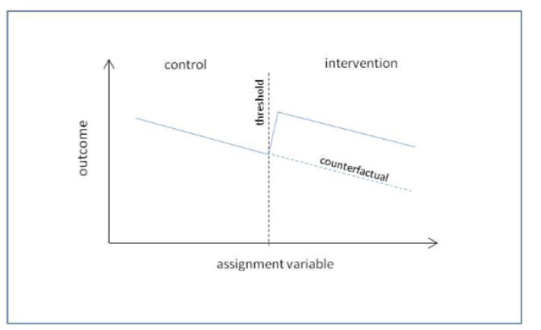
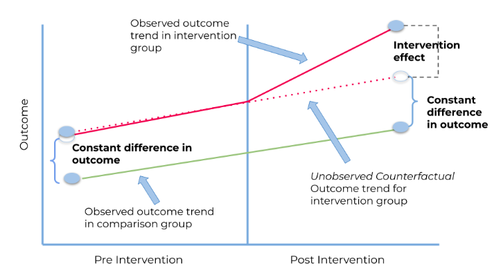

# Sesion 3: Series de tiempo interrumpidas (ITS)

## Aprendizajes esperados

Al final de la sesion, las y los participantes podran:

1.  Reconocer cuando un diseno de **series de tiempo interrumpidas (ITS)** es apropiado para evaluar el impacto de una intervención de salud publica.
2.  Construir las **variables de diseno** de una regresion segmentada: `tiempo`, `post` y `tiempo_post`.
3.  Implementar y comparar modelos ITS con regresion lineal y con Poisson, **ajustando autocorrelacion residual**.
4.  Construir y graficar el **contrafactual**.
5.  Discutir las principales **amenazas a la validez** del diseno.

# Bloque 1: Diseno de series de tiempo interrumpidas

## Que es una ITS?

Un estudio ITS evalua el efecto de una intervencion **bien definida en el tiempo** $T_0$, comparando lo observado despues con lo que **predice la tendencia previa**. Su gran ventaja es que cada unidad de analisis (en nuestro caso, la poblacion de Lima) **es su propio control**: las caracteristicas estables (composicion demografica, geografia, sistema de salud) no cambian entre el "antes" y el "despues".

Compara la evolucion de la serie *despues* de $T_0$ con la trayectoria que se *hubiera esperado* si la intervencion no hubiera ocurrido (contrafactual), basandose en la tendencia observada *antes* de $T_0$

El contrafactual se modela a traves de la extrapolacion de la tendencia pre-intervencion del outcome de interes hacia el periodo de post-intervencion. El impacto de la intervencion es evaluado a traves de cualquier cambio en la tendencia de las observaciones post-intervenciones.

Se usa cuando tienes una serie larga pre y post intervencion para un solo grupo y no hay un grupo control adecuado.

ITS es apropiado cuando:

-   La intervencion tiene una fecha clara de inicio.
-   Hay suficientes puntos de tiempo **antes** y **despues**
-   El outcome se mide de forma consistente antes y despues.



**STI simple (o basico):**

-   Se analiza una sola serie de tiempo en una poblacion o lugar donde ocurrio la interrupcion.

-   Compara el periodo pre-interrupcion con el periodo post-interrupcion *dentro del mismo grupo*.

    -   **Fortaleza:** Relativamente sencillo de implementar si tienes los datos.

    -   **Debilidad:** Vulnerable a que otros eventos ocurran al mismo tiempo que la interrupcion, haciendo dificil atribuir el cambio unicamente a la intervencion estudiada.

**STI con grupo control (STI comparativa):**

-   Ademas de la serie de tiempo del grupo que recibio la intervencion, se incluye una o mas series de tiempo de grupos similares (en caracteristicas y tendencias previas) que *no* recibieron la intervencion (el grupo control).
-   Se compara el cambio observado en el grupo de intervencion con el cambio (o falta de cambio) en el grupo control durante el mismo periodo.
    -   **Fortaleza:** Mucho mas robusto. Ayuda a descartar que los cambios observados se deban a otros factores generales que afectan a ambos grupos (tendencias seculares, eventos nacionales, etc.), fortaleciendo la inferencia causal.
    -   **Debilidad:** Requiere encontrar un grupo control adecuado y tener datos comparables para ambos.

**STI con multiples interrupciones:**

-   Se analizan los efectos de varias intervenciones o cambios a lo largo del tiempo en la misma serie.

## Modelo de regresion segmentada

El modelo mas usado es la **regresion segmentada** (Wagner et al., 2002):

$$Y_t = \beta_0 + \beta_1 t + \beta_2 D_t + \beta_3 (t - T_0) D_t + \varepsilon_t$$

donde $D_t = 0$ antes de la intervencion y $D_t = 1$ despues; $T_0$ es la fecha de la intervencion.

-   $\beta_1$ = pendiente preintervencion (tendencia secular).
-   $\beta_2$ = cambio inmediato de nivel atribuido a la intervencion.
-   $\beta_3$ = cambio de pendiente (efecto sobre la tendencia).
-   $\beta_1 + \beta_3$ = pendiente postintervención.

Este modelo permite separar dos tipos de impacto: un *salto* instantaneo (tipico de regulaciones que entran en vigor de la noche a la manana) y una *aceleracion o desaceleracion* gradual (tipica de programas de implementacion progresiva).

Para el modelo considerar:

-   `tiempo` = indice continuo (1, 2, 3, …, T).
-   `post` = 0 antes de la intervencion, 1 despues.
-   `tiempo_post` = 0 antes; 1, 2, 3, … despues de la intervencion.

> **Decision clave:** decidir, *a priori* y con justificacion conceptual, si esperamos un cambio de **nivel** (efecto inmediato), de **pendiente** (efecto que se acumula), o de ambos. Esa decision debe estar basada en el mecanismo plausible de la intervencion.

## Caso de estudio: "Pico y Placa" en Lima

Escenario hipotetico: el 5 de julio de 2021, la Municipalidad Metropolitana de Lima implementa una restriccion vehicular en horarios pico (lun-vie). Evaluamos su impacto sobre:

-   **PM2.5 ambiental** (mecanismo plausible).
-   **Hospitalizaciones respiratorias semanales** (outcome de salud).

## Setup

```{r setup}
library(dplyr)
library(lubridate)
library(ggplot2)
library(splines)
library(broom)
library(sandwich)   # vcovHC, NeweyWest
library(lmtest)     # coeftest
library(forecast)   # ggAcf
library(MASS)
theme_set(theme_minimal(base_size = 12))

```

```{r load_db}
its <- read.csv("~/Descargas/Curso_2026/Databases/lima_its_pico_placa.csv", stringsAsFactors = FALSE)
its$semana_inicio <- as.Date(its$semana_inicio)
fecha_int <- as.Date("2021-07-05")
glimpse(its)
```

## Visualizacion inicial

```{r vis_pm, warning=FALSE}
ggplot(its, aes(semana_inicio, pm25_sem)) +
  geom_line(colour = "grey40") +
  geom_smooth(method = "loess", span = 0.2, se = FALSE, colour = "steelblue") +
  geom_vline(xintercept = fecha_int, linetype = "dashed", colour = "firebrick") +
  labs(title = "PM2.5 semanal en Lima. Escenario Pico y Placa",
       x = NULL, y = "PM2.5 semanal (µg/m³)")
```

> **Lectura:** se aprecia estacionalidad invernal marcada y, a partir de la linea roja, una caida visible. La pregunta es si esa caida excede lo que la **tendencia y la estacionalidad** habrian predicho de no existir la intervencion.

## Modelo segmentado basico (lineal)

```{r modelo_lineal}
m_pm <- lm(pm25_sem ~ tiempo + post + tiempo_post, data = its)

broom::tidy(m_pm, conf.int = TRUE)
```

> **Lectura:** `post` estima el cambio inmediato de nivel; `tiempo_post` estima el cambio adicional en la pendiente.
>
> Ojo: este modelo **no controla la estacionalidad**.

## Sumar control de estacionalidad

La estacionalidad debe controlarse explicitamente. Para datos semanales, suele bastar con terminos armonicos (seno-coseno) o un spline ciclico del dia del ano.

```{r modelo_estacional}
its <- its |>
  mutate(doy = yday(semana_inicio),
         seno = sin(2*pi*doy/365),
         coseno = cos(2*pi*doy/365))

m_pm2 <- lm(pm25_sem ~ tiempo + post + tiempo_post + seno + coseno,data = its)

broom::tidy(m_pm2, conf.int = TRUE)
```

> **Por que seno y coseno?** Una pareja seno-coseno aproxima un ciclo anual con solo 2 grados de libertad. Es muy parsimoniosa y se interpreta sin esfuerzo. Si la estacionalidad fuese mas compleja se usaria un spline ciclico.

## Diagnostico de autocorrelacion

```{r acf_pm}
forecast::ggAcf(residuals(m_pm2), lag.max = 30) +
  ggtitle("ACF de residuos del modelo ITS (PM2.5)")
```

> **Lectura:** si la ACF muestra picos significativos en lag 1 (y a veces 2-3), los **errores estandar estan subestimados**. Soluciones habituales:
>
> 1.  **Errores estandar HAC (Newey-West):** corrigen IC sin cambiar puntos-estimadores.
> 2.  **GLS con estructura AR(1)** (`nlme::gls(..., correlation =     corAR1())`).
> 3.  **Modelos ARIMA con regresores externos** (`forecast::Arima`).

## Errores estandar Newey-West

**Que problema resuelven?**

Una regresion clasica (`lm()`) calcula los errores estandar (SE) de los coeficientes asumiendo que los residuos son **independientes y homocedasticos** (varianza constante). En series de tiempo esos dos supuestos se rompen sistematicamente:

-   **Heteroscedasticidad:** la varianza de los residuos puede cambiar con el tiempo (p. ej. invierno mas variable que verano).
-   **Autocorrelacion:** el residuo de la semana $t$ se parece al de $t-1$ (las series tienen "inercia").

Cuando ignoramos esto, los SE quedan **subestimados**, los IC quedan **demasiado angostos** y los p-valores **artificialmente pequeños**: declaramos significativo lo que en realidad podria no serlo.

**Que hacen los SE Newey-West?**

Los **errores estandar Newey-West** (Newey & West 1987) son una variante de los llamados **HAC** (*Heteroscedasticity and Autocorrelation Consistent*). Ajustan la matriz de varianzas-covarianzas de los coeficientes incorporando:

1.  Las varianzas heteroscedasticas observadas en cada residuo individual (parte HC).
2.  Las autocorrelaciones de los residuos hasta un cierto rezago L (parte AC).

Lo importante para la persona analista: los puntos-estimadores (`exp(beta)`) NO cambian. Solo cambian los SE –\> los IC se ensanchan, los p-valores se inflan. Es una correccion defensiva: nos protege de declarar efectos espurios.

```{r nw}
nw_vcov <- sandwich::NeweyWest(m_pm2, lag = 4, prewhite = FALSE)

lmtest::coeftest(m_pm2, vcov. = nw_vcov)
```

## Construir y graficar el contrafactual

El contrafactual es la **prediccion para los puntos post-intervencion fijando `post = 0` y `tiempo_post = 0`**, es decir, asumiendo que la intervencion no ocurrio y la tendencia previa continuo.

```{r contrafactual}
its_pred <- its |>
  mutate(
    fitted_obs = predict(m_pm2),
    fitted_cf  = predict(m_pm2,
                         newdata = its |> mutate(post = 0, tiempo_post = 0))
  )

ggplot(its_pred, aes(semana_inicio)) +
  geom_line(aes(y = pm25_sem), colour = "grey60") +
  geom_line(aes(y = fitted_obs), colour = "steelblue", linewidth = 0.8) +
  geom_line(aes(y = fitted_cf),  colour = "firebrick", linewidth = 0.8,
            linetype = "dashed") +
  geom_vline(xintercept = fecha_int, linetype = "dashed") +
  labs(title = "ITS sobre PM2.5: observado, ajustado y contrafactual",
       subtitle = "Azul = ajuste con intervencion vs Rojo punteado = sin intervencion",
       x = NULL, y = "PM2.5 semanal (µg/m³)")
```

### Ejercicio 3.1: Evalue

1.  Calcule la diferencia promedio entre `fitted_obs` y `fitted_cf` en el periodo post-intervencion.
2.  Que fraccion de PM2.5 se redujo, en promedio?
3.  El cambio de pendiente (tiempo_post), es consistente con un efecto sostenido?

```{r ejercicio_3_1, eval=FALSE}
# Tu codigo aqui
# TOME FOTO EN EL CELULAR
```

# Bloque 2: ITS con outcome de salud (Poisson)

Para hospitalizaciones, que son **conteos**, usamos Poisson en lugar de lineal.

```{r its_hosp}
m_hosp <- glm(hosp_resp_sem ~ tiempo + post + tiempo_post + seno + coseno, data = its, family = quasipoisson(link = "log"))

broom::tidy(m_hosp, exponentiate = TRUE, conf.int = TRUE)
```

> **Interpretacion:** los coeficientes exponenciados son **razones de tasas**. `exp(beta_post)` es el cambio inmediato proporcional; `exp(beta_tiempo_post)` es el factor multiplicativo por semana adicional. Si `exp(post) = 0.9`, significa una reduccion inmediata de 10% en hospitalizaciones respiratorias.

## Contrafactual y efecto absoluto

```{r contrafactual_hosp}
its_pred2 <- its |>
  mutate(
    pred_obs = predict(m_hosp, type = "response"),
    pred_cf  = predict(m_hosp,
                       newdata = its |> mutate(post = 0, tiempo_post = 0),
                       type = "response")
  )

ggplot(its_pred2, aes(semana_inicio)) +
  geom_line(aes(y = hosp_resp_sem), colour = "grey60") +
  geom_line(aes(y = pred_obs), colour = "steelblue", linewidth = 0.8) +
  geom_line(aes(y = pred_cf),  colour = "firebrick", linewidth = 0.8,
            linetype = "dashed") +
  geom_vline(xintercept = fecha_int, linetype = "dashed") +
  labs(title = "ITS sobre hospitalizaciones respiratorias",
       x = NULL, y = "Hospitalizaciones / semana")
```

## Hospitalizaciones evitadas (acumulado)

```{r evitadas}
post_period <- its_pred2 |> dplyr::filter(post == 1)

evitadas_total <- sum(post_period$pred_cf - post_period$pred_obs)

n_semanas <- nrow(post_period)

data.frame(semanas_post = n_semanas,
           evitadas_acumuladas = round(evitadas_total),
           evitadas_por_semana = round(evitadas_total / n_semanas, 1))
```

> **Cuidado interpretativo:** la diferencia "evitada" supone que el contrafactual lineal-estacional es valido: ese es el supuesto fuerte de la ITS. Si en el periodo post ocurre **otro evento simultaneo** (p. ej. un cambio de definicion de caso), atribuiremos su efecto a la intervencion.

# Bloque 3: Amenazas a la validez

| Amenaza | Mitigacion practica |
|----|----|
| Co-intervenciones simultaneas | Reportarlas; analisis con grupo control (CITS). |
| Cambio de definicion de caso o de fuente de datos | Revisar protocolo del registro a lo largo del periodo. |
| Tendencia pre-intervencion mal modelada (no lineal) | Probar splines o terminos cuadraticos. |
| Efecto retardado (no inmediato) | Permitir ventana de "transicion" (p. ej. excluir 4 semanas alrededor de la fecha). |
| Estacionalidad mal capturada | Probar mas terminos armonicos o splines ciclicos. |
| Autocorrelacion residual | Newey-West / GLS / ARIMA. |
| Tamano de muestra insuficiente | Minimo \~12 puntos pre y post; idealmente mas. |

### Ejercicio 3.2: Analisis de sensibilidad: ventana de transicion

Reajusta el modelo `m_hosp` **excluyendo** las 4 semanas inmediatamente posteriores a la intervencion (ventana de transicion). Pista:

```{r}
its_sens <- its |>
  mutate(excluir = (semana_inicio >= fecha_int) &
                   (semana_inicio <  fecha_int + weeks(4))) |>
  dplyr::filter(!excluir)
```

1.  Cambia mucho `exp(post)`?
2.  Que interpretacion tendria que la sensibilidad cambie el signo del efecto?

```{r ejercicio_3_2, eval=FALSE}
# Tu codigo aqui
# GIAN: NO ME SALIO REVISAR QUE SE TIENE QUE HACER AQUI
its_pred2_sens <- its_sens |>
  mutate(
    pred_obs = predict(m_hosp, type = "response"),
    pred_cf  = predict(m_hosp,
                       newdata = its_sens |> mutate(post = 0, tiempo_post = 0),
                       type = "response")
  )
ggplot(its_pred2_sens, aes(semana_inicio)) +
  geom_line(aes(y = hosp_resp_sem), colour = "grey60") +
  geom_line(aes(y = pred_obs), colour = "steelblue", linewidth = 0.8) +
  geom_line(aes(y = pred_cf),  colour = "firebrick", linewidth = 0.8,
            linetype = "dashed") +
  geom_vline(xintercept = fecha_int, linetype = "dashed") +
  labs(title = "ITS sobre hospitalizaciones respiratorias",
       x = NULL, y = "Hospitalizaciones / semana")
```

### Ejercicio 3.3: Modelo cuadratico en la tendencia pre

1.  Suma `I(tiempo^2)` al modelo lineal de PM2.5 y reestimar.
2.  Como cambia el coeficiente `post`?
3.  Si la tendencia pre no es lineal, que tan creible es el contrafactual lineal?

```{r ejercicio_3_3, eval=FALSE}
# Tu codigo aqui
```

### Ejercicio 3.4: Comparacion de modelos para hospitalizaciones

1.  Ajusta para `hosp_resp_sem` un modelo binomial negativo (`MASS::glm.nb()`).
2.  Compara los coeficientes y los IC con los del quasi-Poisson.
3.  Cuando se preferiria binomial negativa sobre quasi-Poisson?

```{r ejercicio_3_4, eval=FALSE}
# Tu codigo aqui
```

## Diferencias en Diferencias (DiD)

Comparar el indicador de PM2.5 u otro en una region *antes* y *después* del programa no es suficiente, porque quizas el indicador estaba mejorando de todas formas por otras razones (una tendencia general). Tampoco sirve comparar la region con el programa con otra región sin el programa *solo despues* de implementarlo, porque quizas esas regiones ya eran diferentes desde el principio.

$\delta_{DiD} = (\Delta Y_{tratamiento}) - (\Delta Y_{Control})$

DiD combina ambas comparaciones:

1.  Calcula como cambió el resultado *a lo largo del tiempo* (de antes a despues) dentro del grupo que recibio la intervencion (grupo de tratamiento).

2.  Calcula como cambio el resultado *a lo largo del mismo tiempo* (de antes a despues) dentro de un grupo similar que *no* recibio la intervencion (grupo de control).

3.  **DiD**: **Resta el cambio del grupo de control del cambio del grupo de tratamiento.** La idea es que el cambio en el grupo de control representa lo que hubiera pasado en el grupo de tratamiento si no hubiera habido intervencion (debido a tendencias generales u otros factores comunes). La diferencia que queda ("la diferencia en las diferencias") se atribuye al efecto de la intervencion.



**El supuesto crucial: Tendencias paralelas (Parallel trends)**

Esta es la piedra angular del DiD. Se asume que, **si la intervencion no hubiera ocurrido**, el grupo de tratamiento y el grupo de control habrian seguido la **misma trayectoria o tendencia** en el resultado a lo largo del tiempo.

-   No significa que deban tener el mismo nivel del resultado *antes*, sino que sus *cambios* a lo largo del tiempo hubieran sido paralelos.

-   Podemos (y debemos) verificar si las tendencias fueron paralelas *antes* de la intervencion usando datos de multiples periodos pre-intervencion. Si no lo eran, el supuesto es dudoso.

-   *No podemos* probar directamente que las tendencias hubieran sido paralelas *despues* de la intervencion en ausencia de esta, por eso es un supuesto.

# Cierre

1.  Que le dirias a un decisor que pregunta "¿la politica funciono?" basandose en estos resultados?
2.  Identifiquen al menos **una amenaza a la validez** especifica de este escenario que el modelo NO controla.
3.  Como combinarian el analisis ITS con el estudio de exposicion de los dias que ya hicimos en la Sesion 2?
