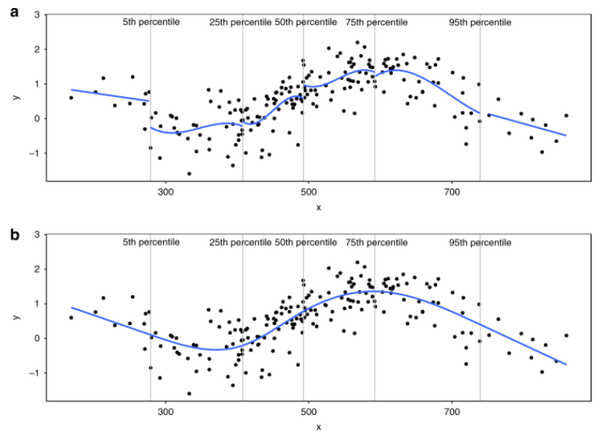
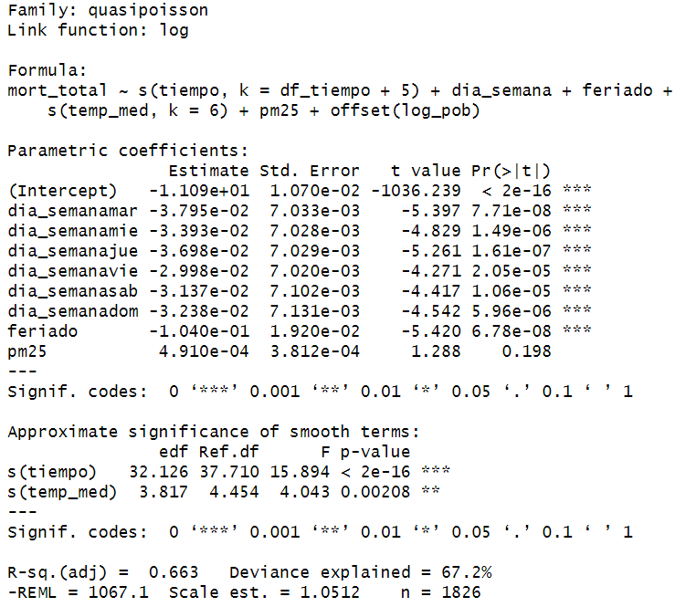

# Sesion 4: GLM, GAM y efectos retardados

## Aprendizajes esperados

Al final de la sesion, las y los participantes podran:

1.  Diferenciar entre **GLM** con splines parametricos y **GAM** (`mgcv`) con suavizamiento penalizado.
2.  Modelar el efecto **no lineal** de la temperatura sobre la mortalidad y elegir parametros de suavizamiento de manera justificada.
3.  Definir el concepto de **efecto retardado (lag)** y modelar lags simples mediante variables construidas (mismo día, lag 1, lag 2) o promedios moviles.
4.  Visualizar e interpretar las **funciones de respuesta** estimadas (curva exposicion-respuesta).

# Bloque 1: Del lineal al no lineal

## Por que la temperatura no es lineal?

La relacion entre temperatura y mortalidad es tipicamente **en J o en U**: el riesgo aumenta tanto en dias frios como en dias calurosos, con un minimo (la **MMT, Minimum Mortality Temperature**) que depende del clima local. La literatura sugiere una MMT en torno a 21 °C en ciudades como Lima.

Forzar una relacion lineal puede **anular** un efecto que en realidad existe pero con signos opuestos en cada extremo, o desplazar el estimado hacia el lado donde hay mas datos.

## Que es un GAM?

Un GAM (Hastie y Tibshirani, 1986) extiende un GLM permitiendo que cada predictor entre como una **funcion suave no especificada** $f_j(x_j)$, en lugar de un termino lineal $\beta_j x_j$. La estructura es:

$$g(\mu_t) = \beta_0 + f_1(x_{t1}) + f_2(x_{t2}) + \dots + f_p(x_{tp})$$

Las funciones $f_j$ se estiman a partir de los datos, tipicamente como **splines penalizados**: combinaciones lineales de funciones base (B-splines, cubic regression splines, *thin plate*) cuyo coeficiente de "rugosidad" se penaliza para evitar el sobreajuste. El parametro de suavizado $\lambda_j$ controla el trade-off entre ajuste y suavidad y se estima por validacion cruzada generalizada (GCV) o por maxima verosimilitud restringida (REML).

## Diferencias con regresion lineal, GLM

-   **Regresion lineal:** asume $E[Y] = X\beta$, errores Normales, efectos lineales. Un GAM relaja la linealidad y, via el componente aleatorio, tambien la normalidad.
-   **GLM:** mantiene linealidad en los coeficientes pero admite distribuciones no Normales y enlaces. Un GAM mantiene la familia exponencial y el enlace, pero permite efectos no lineales.

En epidemiologia ambiental, el GAM es especialmente util porque las relaciones temperatura-mortalidad son tipicamente **no lineales en forma de U o J**, y porque el tiempo necesita una suavizacion flexible.

## Elementos clave de un GAM

1.  **Funciones base:** `bs = "cr"` (cubic regression), `bs = "tp"` (thin plate, default), `bs = "cc"` (cyclic cubic, ideal para variables circulares como mes o dia del anio).
2.  **Grados de libertad efectivos** (`edf`): cuanto de la flexibilidad se esta usando; se reportan en `summary()`.
3.  **Parametro de suavizado** $\lambda$: estimado automaticamente; controla cuan "ondulada" puede ser la funcion.
4.  **Penalizacion** sobre la segunda derivada (rugosidad) para evitar sobreajuste.
5.  **Familia y enlace:** las mismas que en GLM (Poisson, Gamma, etc.).

## Para que se usan?

-   Cuando se sospechan relaciones no lineales entre predictores continuos y la respuesta.

-   Modelar efectos complejos de variables como temperatura, contaminacion, o tiempo (tendencias, estacionalidad) sin especificar una forma funcional *a priori*.

-   Analisis de series de tiempo, capturando patrones temporales no lineales.

**Pros**

-   Flexibilidad para capturar relaciones no lineales complejas.

-   Reduce el riesgo de sesgo por mala especificacion de la forma funcional.

-   Permite visualizar las relaciones no lineales estimadas.

-   Mantiene la interpretabilidad aditiva (el efecto de cada variable se suma).

**Cons**

-   Pueden ser computacionalmente mas intensivos que los GLM.

-   La seleccion del grado de suavidad (numero de "nudos" o base de los splines) puede ser compleja (aunque a menudo se maneja con validacion cruzada o REML/ML dentro del paquete `mgcv`).

-   La interpretacion de las funciones suaves es mas visual que numerica (no hay un unico "coeficiente" para el efecto no lineal).

-   Mayor riesgo de sobreajuste si no se controla adecuadamente la complejidad de las funciones suaves.

## **Splines**

Imagina que estas tratando de predecir algo (probabilidad de enfermedad, etc.) usando otra variable (como gasto en publicidad, edad, etc.).

**Modelos lineales (y GLM basicos):** Piensa en ajustar una **regla recta** a tus datos. Un GLM basico asume que la relacion entre tu predictor y la respuesta es lineal, como una linea recta. Si sube el predictor, la respuesta (transformada) sube o baja siempre en la misma proporcion

**El problema:** Que pasa si la relacion **no** es una linea recta? Quizas al principio sube rapido, luego mas lento, y quizas hasta baja un poco. Una regla recta no se ajustara bien a esa curva.

**La solucion: Splines**

-   Imagina que en lugar de una regla recta, tienes una **tira de metal flexible** (eso es un "spline" en dibujo tecnico). Puedes doblarla suavemente para que siga la forma de tus datos curvos.

-   En estadistica, un spline hace algo parecido: divide el rango de tu variable predictora en **varios segmentos**, usando puntos llamados **"nudos"**.

-   Dentro de cada segmento, el spline ajusta una **curva simple** (normalmente un polinomio, como una parabola o una curva cubica).

-   Lo mas importante: estas curvas simples se **unen suavemente** en los nudos, sin picos ni saltos bruscos. El resultado es una **unica curva suave y flexible** que puede adaptarse a patrones complejos en los datos.



### Ejemplo splines usando GLM

```{r}
# Ejemplo de splines (de practica solamente)
n <- 100
set.seed(101)
x <- sort(rnorm(n, sd = 2))
mu <- 2 + 0.1*x - 0.6*x^2 + 0.18*x^3 #linear predictor

y <- rpois(n, exp(mu))
plot(x, y)
lines(x, exp(mu))
```

```{r}
#log linear model
m1 <- glm(y ~ x, family = "poisson") # DF = 1 
m1pred <- predict(m1, type = "response")

#non-linear models
m2 <- glm(y ~ ns(x,2), family = "poisson") # Permite mas dobleces ("knots")
m2pred <- predict(m2, type = "response")

m3 <- glm(y ~ ns(x,3), family = "poisson") # Cubic polynomial
m3pred <- predict(m3, type = "response")

par(mfrow = c(1,3))
plot(x, y, main = "DF = 1")
lines(x, exp(mu), lwd = 2, col = "grey")
lines(x, m1pred, col = "orange", lwd = 2)

plot(x, y, main = "DF = 2")
lines(x, exp(mu), lwd = 2, col = "grey")
lines(x, m2pred, col = "purple", lwd = 2)

plot(x, y, main = "DF = 3")
lines(x, exp(mu), lwd = 2, col = "grey")
lines(x, m3pred, col = "darkblue", lwd = 2)
```

```{r}
AIC(m1)
AIC(m2)
AIC(m3)
```

## Donde entra GAM?

El GAM es la evolucion del GLM con splines. Usamos `s()` para el tiempo y potencialmente para los predictores continuos, dejando que `mgcv` determine la suavidad optima (flexibilidad) mediante penalizacion.

**Consideraciones clave:**

1.  **Modelado flexible del tiempo:** La gran ventaja de GAM es el uso de funciones suaves, tipicamente `s(tiempo, ...)`. Este unico termino puede capturar simultaneamente:

    -   **Tendencias no lineales:** Ajusta curvas suaves a largo plazo sin asumir una forma especifica (lineal, cuadrática, etc.).

    -   **Estacionalidad compleja:** Modela los ciclos estacionales, incluso si no son perfectamente sinusoidales o cambian ligeramente de anio en anio. La flexibilidad del spline se adapta a estos patrones. La eleccion de `k` (dimension de la base del spline) para `s(tiempo)` es importante; debe ser suficientemente grande para capturar la variabilidad anual y la tendencia.

    -   **Smoothing**:

        -   `s()` Smooth Term: Modela la relacion suave (no lineal) entre una variable predictora continua y la respuesta (en la escala del predictor lineal)

        -   `te()` Tensor product Smooth: Modela la interaccion suave y no lineal entre dos o mas variables predictoras continuas

        -   `ti()` Tensor Interaction Smooth: Modela únicamente la parte de la interacción entre dos o mas variables continuas que NO puede ser explicada por sus efectos principales aditivos. Está disenado para ser usado junto con los terminos `s()` para los efectos principales.

    -   **Basis**: Para representar la curva de suavizamiento

        -   Thin plate regression splines –\> bs="tp"

        -   Cubic regression splines –\> bs="cr"

        -   P-splines - splines penalizados –\> bs="ps"

        -   Cyclic Cubic Splines –\> bs = "cc"

        -   <https://stat.ethz.ch/R-manual/R-devel/library/mgcv/html/smooth.terms.html>

-   **Control de confusion temporal y autocorrelacion:** Al modelar explicita y flexiblemente la dependencia del resultado con el tiempo (`s(tiempo)`), el GAM ajusta eficazmente por muchos factores de confusion que varian suavemente en el tiempo (como cambios graduales en la poblacion, mejoras en la atencion medica, estacionalidad de otras enfermedades). Ademas, este término a menudo **absorbe una parte significativa de la autocorrelacion** presente en los datos, ya que captura la dependencia serial que surge de patrones temporales no modelados. Incluir tambien `dia_semana` como factor suele ser necesario para capturar ciclos semanales abruptos.
-   **Manejo de autocorrelacion residual:** Si despues de incluir `s(tiempo)` y otros predictores relevantes, los residuos del modelo todavia muestran autocorrelacion significativa, existen extensiones:
    -   **GAMM (Modelos Aditivos Generalizados Mixtos):** Usando la funcion `gamm()` (o `gam()` con ciertas familias en `mgcv`), se puede ajustar el GAM dentro de un marco de modelo mixto, lo que permite especificar estructuras de correlacion para los residuos (e.g., AR(1), ARMA). Esto modela explicitamente la correlacion restante.

    -   **Inclusion de lags del resultado/residuos:** Se puede incluir la variable respuesta retardada (`lag(respuesta)`) o residuos retardados como predictores adicionales, aunque esto cambia la interpretacion del modelo.
-   **Integracion con efectos retardados (DLNM):** Los GAM forman la base de los Modelos Distribuidos de Lags No Lineales (DLNM).
-   **Modelado de interacciones temporales:** Los GAM facilitan el modelado de como el efecto de una exposicion puede cambiar con el tiempo, por ejemplo, si el efecto del calor es mas pronunciado en ciertas epocas del anio. Esto se puede hacer con terminos de interaccion suaves como `te(tiempo, temperatura)` o `ti(tiempo, temperatura)`.

## Lags en GAMs

Los rezagos en GAM se introducen, en su forma simple, igual que en GLM: creando variables rezagadas y suavizandolas. Tres estrategias:

1.  **Suavizar un unico rezago:**

    ```{r}
    # library(mgcv)
    # datos$temp_l0 <- datos$temp

    # m_gam_l0 <- gam(muertes ~ s(temp_l0, k = 7) +
    #                             s(t, k = 8 * 7) + dow,
    #                 family = quasipoisson, data = datos, method = "REML")
    ```

2.  **Suavizar el promedio de una ventana de rezagos:**

    ```{r}
    # library(zoo)
    # datos$temp_ma021 <- rollmean(datos$temp, 22, align = "right", fill = NA)

    # m_gam_ma <- gam(muertes ~ s(temp_ma021, k = 7) +
    #                             s(t, k = 8 * 7) + dow,
    #                 family = quasipoisson, data = datos, method = "REML")
    ```

3.  **Suavizar tensorialmente exposicion × rezago:** se usa una matriz $L \times N$ con los rezagos y se aplica un *tensor product smooth* `te(temp, lag)`. Esta es la idea que conduce, llevada al extremo, a los DLNM.

## Splines parametricos vs. splines penalizados (GAM)

| Enfoque | Como se elige la complejidad | Pros | Contras |
|----|----|----|----|
| GLM + `ns()` parametrico (`splines`) | Manualmente: `df` | Transparente, facil de reportar | Hay que justificar `df`; no es optimo automáticamente |
| GAM penalizado (`mgcv::gam`, `s()`) | Automaticamente via REML/GCV | Suavizamiento optimo; menos arbitrario | Menos directo de interpretar; a veces "alisa" demasiado |

Ambos enfoques son validos y conviven en la literatura. Usaremos `ns()` para mantener el modelo de la Sesion 2 y luego compararemos con `gam()`.

# Bloque 2: Practica: efecto no lineal de temperatura (mismo dia)

## NOTA: Padre de los GAMs: Simon ...

## Setup

```{r setup}

library(dplyr)
library(lubridate)
library(ggplot2)
library(splines)
library(mgcv)        # GAM
library(broom)
library(tidyr)
library(zoo)         # rollmean para construir lags
theme_set(theme_minimal(base_size = 12))

lima <- read.csv("Databases/lima_diario_2019_2023.csv", stringsAsFactors = FALSE) 
lima$fecha <- as.Date(lima$fecha) 
lima$dia_semana  <- factor(lima$dia_semana, levels = c("lun","mar","mie","jue","vie","sab","dom")) 

lima$tiempo <- as.numeric(lima$fecha - min(lima$fecha)) # dias desde el inicio
lima$log_pob <- log(lima$poblacion_anual) 

n_anios <- as.numeric(diff(range(lima$fecha))) / 365.25 
df_tiempo <- round(8 * n_anios) # ~8 df por anio
```

## Modelo GLM con spline natural en temperatura

```{r glm_ns}
m_ns <- glm(mort_total ~ ns(tiempo, df = df_tiempo) + dia_semana + feriado + ns(temp_med, df = 4) + pm25,
            offset = log_pob,
            data = lima, family = quasipoisson(link = "log"))

```

> **Decision:** `df = 4` para `temp_med` es un punto de partida comun que permite curvatura (incluyendo formas en U) sin sobreajustar. Lo evaluaremos con sensibilidad.

### Visualizar la curva exposicion-respuesta

```{r ns_plot}
# Predicciones a lo largo del rango observado de temperatura, fijando el resto de covariables en valores tipicos (mediana de tiempo, lunes, no feriado, mediana de pm25). Tomamos la mediana de tiempo como referencia neutral.

grid_t <- data.frame(
  temp_med   = seq(min(lima$temp_med), max(lima$temp_med), length.out = 200),
  tiempo     = median(lima$tiempo),
  dia_semana = factor("lun", levels = levels(lima$dia_semana)),
  feriado    = 0,
  pm25       = median(lima$pm25),
  log_pob    = median(lima$log_pob)        # <-- AGREGAR ESTA LINEA
)

# Prediccion en escala log + IC
pr <- predict(m_ns, newdata = grid_t, se.fit = TRUE)
# Para reportar RR, centramos en la temperatura de referencia (21 °C, MMT esperada)
ref_t <- 21   # OJO: CAMBIAR Y VER QUE PASA
pr_ref <- predict(m_ns, newdata = transform(grid_t, temp_med = ref_t),
                  se.fit = TRUE)

grid_t$RR     <- exp(pr$fit - pr_ref$fit)
grid_t$RR_lo  <- exp(pr$fit - pr_ref$fit - 1.96 * sqrt(pr$se.fit^2 + pr_ref$se.fit^2))
grid_t$RR_hi  <- exp(pr$fit - pr_ref$fit + 1.96 * sqrt(pr$se.fit^2 + pr_ref$se.fit^2))

ggplot(grid_t, aes(temp_med, RR)) +
  geom_ribbon(aes(ymin = RR_lo, ymax = RR_hi), fill = "grey80") +
  geom_line(colour = "firebrick", linewidth = 1) +
  geom_hline(yintercept = 1, linetype = "dashed") +
  geom_vline(xintercept = ref_t, linetype = "dotted") +
  labs(title = "Mortalidad vs temperatura (GLM + spline natural, df=4)",
       subtitle = "Referencia: 21 °C (MMT esperada para Lima)",
       x = "Temperatura media diaria (°C)",
       y = "Riesgo relativo (RR)")
```

> **Lectura?**

```{r}
mmt_empirica <- grid_t$temp_med[which.min(grid_t$RR)]
mmt_empirica
```

```{r}
mmt_empirica <- grid_t$temp_med[which.min(grid_t$RR_lo)]
mmt_empirica
```

## Mismo modelo con GAM

```{r gam_basico}
m_gam <- mgcv::gam(mort_total ~ s(tiempo, k = df_tiempo + 5) +
                     dia_semana + feriado + s(temp_med, k = 6) + pm25 + offset(log_pob),
                   data = lima, family = quasipoisson(link = "log"),
                   method = "REML")
summary(m_gam)
```

### Comparacion grafica

```{r gam_plot}
plot(m_gam, select = 2, shade = TRUE, rug = TRUE,
     xlab = "Temperatura media (°C)",
     ylab = "s(temp_med)  [escala log-RR]",
     main = "Suavizamiento penalizado de la temperatura (mgcv::gam)")
abline(h = 0, lty = 3)
```

## Diagnostico de un GAM

Una de las grandes ventajas del paquete `mgcv` es que ofrece un set de herramientas de diagnostico especificas para suavizamiento penalizado, que no estan disponibles en `splines + glm()`. Las cuatro mas importantes son:

1.  **`summary()`: lectura de los terminos suaves**

El `summary()` de un objeto GAM devuelve dos tablas:

-   **Parametric coefficients:** los coeficientes de los efectos *lineales* (intercepto, factores como `dia_semana`, variables incluidas sin suavizar como `pm25`).
-   **Approximate significance of smooth terms:** una tabla por cada `s(...)` con cuatro columnas clave:
    -   **`edf`** (effective degrees of freedom): cuantos "grados efectivos" usa el smooth despues de la penalizacion. Un edf cercano a 1 –\> casi lineal; edf alto –\> muy curvado. Esta es la cifra mas informativa.
    -   **`Ref.df`:** referencia de los df para el test estadistico.
    -   **`F`:** estadistico aproximado para evaluar significancia del smooth.
    -   **`p-value`:** test aproximado de la hipotesis nula "el smooth es identicamente cero".

{width="506"}

2.  **`gam.check()`: chequeo del basis y residuos**

```{r gam_check, fig.height=6}
par(mfrow = c(2, 2))
gam.check(m_gam)
par(mfrow = c(1, 1))
```

Que muestra `gam.check()`:

-   **4 graficos de diagnostico** estandar de regresion (residuos vs fitted, Q-Q plot, histograma de residuos, response vs fitted).
-   **Una tabla en consola** con 4 columnas para cada smooth:
    -   `k'`: el `k` que la persona analista especifica.
    -   `edf`: los grados de libertad efectivos usados.
    -   `k-index`: indicador del tamano del basis. Si `k-index < 1`, es senal de que el `k` puede ser insuficiente y se esta recortando curvatura real.
    -   `p-value`: p-valor del test de adecuacion del basis.

> Regla practica: si `edf` esta cerca de `k'` (digamos \> 70 % de `k'`), conviene aumentar `k` para no estar limitando artificialmente la flexibilidad del smooth.

3.  **`concurvity()`: el analogo de la multicolinealidad**

En modelos GAM con varios smooths, dos suavizamientos pueden estar parcialmente confundidos entre si: por ejemplo, `s(tiempo)` y `s(temp_med)` ambos absorben variacion estacional. La concurvidad mide cuanto un smooth puede ser predicho por los demas. Es el equivalente no-lineal de la multicolinealidad.

```{r concurv}
mgcv::concurvity(m_gam, full = TRUE)
```

Lectura?: una matriz por cada smooth con tres metricas (`worst`, `observed`, `estimate`). La mas conservadora es `worst`. Valores:

-   **0.0 - 0.3:** concurvidad baja, sin problemas.
-   **0.3 - 0.7:** concurvidad moderada, vigilar.
-   **0.7 - 1.0:** concurvidad alta. Los efectos individuales pueden estar mal identificados: los puntos-estimadores son inestables y los IC poco confiables.

```{r concurv_pares}
# Detalle por pares de terminos
mgcv::concurvity(m_gam, full = FALSE)$worst
```

> **En este modelo en particular,** esperamos concurvidad moderada entre `s(tiempo)` y `s(temp_med)` porque la temperatura es muy estacional y el spline del tiempo absorbe esa estacionalidad. Eso es un trade-off conocido en la literatura. No se "soluciona", se reporta y se discute.

4)  **ACF de residuos: queda autocorrelacion?**

```{r acf_gam}
acf(residuals(m_gam, type = "deviance"),
    lag.max = 30,
    main = "ACF de residuos del GAM")
```

**Lectura:** si la ACF cae rapidamente a cero dentro de los IC azules (salvo eventualmente lag 1-2), el modelo capturo bien la estructura temporal. Si quedan picos significativos a lag 7 o 365, el modelo no absorbio del todo la estacionalidad –\> reconsiderar `k` o el suavizamiento.

5.  **Visualizacion compacta de todos los efectos parciales**

```{r gam_plot_all, fig.height=6}
par(mfrow = c(2, 2))
plot(m_gam, shade = TRUE, seWithMean = TRUE, scale = 0)
par(mfrow = c(1, 1))
```

Para que sirve cada argumento:

-   `shade = TRUE`: dibuja el IC del 95 % como banda gris.
-   `seWithMean = TRUE`: incluye la incertidumbre del intercepto en el IC, dando una banda mas honesta (y mas ancha).
-   `scale = 0`: cada panel usa su propia escala vertical, facil de leer cuando los efectos son de magnitudes muy distintas.

## Seleccion de los grados de libertad

Como regla operativa en epidemiologia ambiental:

-   **Tiempo calendario** (tendencia + estacionalidad anual): 7-10 df por anio.
-   **Dia del anio** (estacionalidad pura, base ciclica): 4-6 df.
-   **Temperatura**: 3-6 df; valores altos pueden absorber el efecto si la serie es larga.
-   **PM2.5**: 3-4 df, frecuentemente bastante con un termino lineal.

Siempre realizar **analisis de sensibilidad**: variar los df y observar la estabilidad del efecto estimado.

### Ejercicio 4.1: Sensibilidad a df y k

1.  Reajusta el GLM con `df = 3, 5, 7` para `ns(temp_med)`. Como cambia la posicion de la MMT estimada?
2.  Reajusta el GAM con k = 4, 6, 10. Cambia el `edf`?
3.  Cuando confiarias mas en `mgcv` y cuando en `ns()`?

```{r ejercicio_4_1, eval=FALSE}
# Tu codigo aqui
# HECHO POR MI
m_ns_3 <- glm(mort_total ~ ns(tiempo, df = df_tiempo) + dia_semana + feriado + ns(temp_med, df = 3) + pm25,
            offset = log_pob,
            data = lima, family = quasipoisson(link = "log"))
m_ns_3
```

```{r gam_basico}
# HECHO POR MI
# k=4
m_gam_4 <- mgcv::gam(mort_total ~ s(tiempo, k = df_tiempo + 5) +
                     dia_semana + feriado + s(temp_med, k = 4) + pm25 + offset(log_pob),
                   data = lima, family = quasipoisson(link = "log"),
                   method = "REML")
summary(m_gam_4)
```

```{r gam_check, fig.height=6}
# HECHO POR MI
par(mfrow = c(2, 2))
gam.check(m_gam_4)
par(mfrow = c(1, 1))
```

# Bloque 3: Introduccion a los efectos retardados (lags)

## Intuicion

Una exposicion ambiental no necesariamente actua **solo el mismo dia**. Ejemplos:

-   **Calor extremo:** efecto agudo, suele observarse en lag 0-3 dias. Algunas muertes son por "harvesting" (anticipacion de muertes inminentes), otras son por estres cardiovascular agudo.
-   **Frio:** efecto **prolongado**, hasta 21-28 dias. Mecanismos: enfermedades respiratorias, infecciones que se desarrollan en días, descompensacion cardiovascular cronica.
-   **PM2.5:** efectos en lag 0-2 dias, principalmente cardiopulmonar.

Modelar el lag importa por dos razones:

1.  **Validez:** si solo modelamos el mismo dia, perdemos buena parte del efecto del frio y subestimamos el riesgo total.
2.  **Sentido biologico:** la forma del lag **es** una pregunta cientifica (cuantos dias dura el riesgo?, hay harvesting?).

## Construir variables de lag manualmente

Para construir lags, usamos `dplyr::lag()`:

```{r lags_manual}
lima <- lima |>
  arrange(fecha) |>
  mutate(
    temp_l1 = lag(temp_med, 1),
    temp_l2 = lag(temp_med, 2),
    temp_l3 = lag(temp_med, 3),
    pm25_l1 = lag(pm25, 1),
    pm25_l2 = lag(pm25, 2)
  )

# Observar las primeras filas
head(lima[, c("fecha","temp_med","temp_l1","temp_l2","temp_l3")])
```

## Modelo con lags individuales (lineal en cada lag)

```{r modelo_lags}
m_lags <- glm(mort_total ~ ns(tiempo, df = df_tiempo) + dia_semana + feriado + temp_med + temp_l1 + temp_l2 + temp_l3 + pm25 + pm25_l1 + pm25_l2,
              offset = log_pob,
              data = lima, family = quasipoisson(link = "log"))

broom::tidy(m_lags, exponentiate = TRUE, conf.int = TRUE) |>
  dplyr::filter(grepl("^(temp|pm25)", term))
```

> **Limitacion:** los lags estan **muy correlacionados** entre si (multicolinealidad). Los IC de cada coeficiente individual se ensanchan, y los puntos-estimadores se vuelven inestables. La Sesion 5 introduce los **modelos de rezagos distribuidos** (DLNM) que resuelven exactamente este problema.

## Una alternativa: promedio movil

Cuando interesa el **efecto acumulado** y no la forma del lag, se puede usar la **media movil** de la exposición:

```{r ma}
lima <- lima |>
  arrange(fecha) |>
  mutate(
    temp_ma_0_21 = rollmean(temp_med, k = 22, fill = NA, align = "right"),
    pm25_ma_0_2  = rollmean(pm25,     k =  3, fill = NA, align = "right")
  )

m_ma <- glm(mort_total ~ ns(tiempo, df = df_tiempo) + dia_semana + feriado + ns(temp_ma_0_21, df = 4) + pm25_ma_0_2,
            offset = log_pob,
            data = lima, family = quasipoisson(link = "log"))

broom::tidy(m_ma, exponentiate = TRUE, conf.int = TRUE) |>
  dplyr::filter(grepl("^(pm25_ma|ns\\()", term)) |>
  head()
```

> **Decision metodologica:**
>
> -   Si conceptualmente interesa el **efecto acumulado a 3 semanas** del frio (caso tipico para mortalidad por causa cardiovascular y respiratoria), un promedio movil es razonable.
> -   Si interesa **separar** lag agudo (calor, lag 0-3) de lag prolongado (frio, lag 0-21), conviene un DLNM (Sesion 5).

## Visualizar curva con la media movil

```{r ma_plot}
grid_ma <- data.frame(
  temp_ma_0_21 = seq(min(lima$temp_ma_0_21, na.rm = TRUE),
                     max(lima$temp_ma_0_21, na.rm = TRUE),
                     length.out = 200),
  tiempo       = median(lima$tiempo),
  dia_semana   = factor("lun", levels = levels(lima$dia_semana)),
  feriado      = 0,
  pm25_ma_0_2  = median(lima$pm25_ma_0_2, na.rm = TRUE),
  log_pob = median(lima$log_pob)
)
pr  <- predict(m_ma, newdata = grid_ma, se.fit = TRUE)
prR <- predict(m_ma, newdata = transform(grid_ma, temp_ma_0_21 = 22),
               se.fit = TRUE)
grid_ma$RR    <- exp(pr$fit - prR$fit)
grid_ma$RR_lo <- exp(pr$fit - prR$fit - 1.96 * sqrt(pr$se.fit^2 + prR$se.fit^2))
grid_ma$RR_hi <- exp(pr$fit - prR$fit + 1.96 * sqrt(pr$se.fit^2 + prR$se.fit^2))

ggplot(grid_ma, aes(temp_ma_0_21, RR)) +
  geom_ribbon(aes(ymin = RR_lo, ymax = RR_hi), fill = "grey80") +
  geom_line(colour = "firebrick", linewidth = 1) +
  geom_hline(yintercept = 1, linetype = "dashed") +
  geom_vline(xintercept = 21, linetype = "dotted") +
  labs(title = "Mortalidad vs temperatura promedio (lag 0-21 dias)",
       x = "Temperatura promedio 22 dias (°C)",
       y = "RR (referencia 21 °C)")
```

### Ejercicio 4.2: Mortalidad respiratoria con lag

1.  Construya un modelo GLM Poisson para `mort_resp` con `temp_ma_0_21` (spline `ns(., df = 4)`) y `pm25_ma_0_2`.
2.  Grafique la curva exposicion-respuesta.
3.  Compare la magnitud del efecto frio (T = 15 °C vs 22 °C) entre `mort_total` y `mort_resp`. La causa respiratoria es mas sensible al frio?

```{r ejercicio_4_2, eval=FALSE}
# Tu codigo aqui
```

### Ejercicio 4.3: Comparacion GLM vs GAM

1.  Ajuste el mismo modelo (`mort_total`, `controles temporales`, `temp_ma_0_21`) usando `mgcv::gam()` con `s(temp_ma_0_21)`.
2.  Compare graficamente las dos curvas (`ns()` con `df = 4` y `s()` penalizado).
3.  Discuta cual parece mas razonable y por que.

```{r ejercicio_4_3, eval=FALSE}
# Tu codigo aqui
```

# Cierre

1.  Por que un analisis solo con la temperatura del mismo dia suele subestimar el efecto del frio?
2.  Que informacion se pierde al usar la media movil en vez de los lags individuales?
3.  Si tuviera que reportar un solo numero para "el efecto del frio en Lima", cual usaria y por que?
